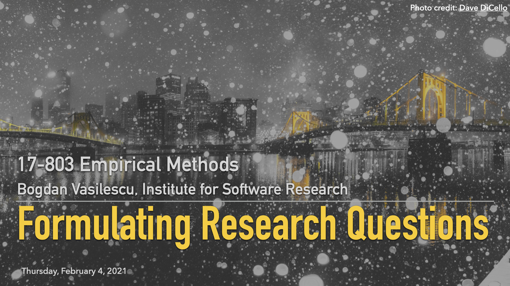

## L2: Formulating Research Questions ([pdf](../slides/02-rqs.pdf), [video](https://youtu.be/MNLXuDKzy4U))

Every research project needs some research question(s) and choosing questions is among the first steps you take, as they impact your choice of methods. With two researchers, Jane and Joe, as running examples, in this lecture we review a number of different research questions each could focus on, and discuss how each could lead to a different direction in developing research strategies. Often, the most obvious reserach question is not the best choice for a starting point.

### Readings

The lecture is based on the following sources. Do the readings yourselves to get all the nuance. I'm sure I didn't do them justice in my slides. 

> Easterbrook, S., Singer, J., Storey, M. A., & Damian, D. (2008). Selecting empirical methods for software engineering research. In Guide to advanced empirical software engineering (pp. 285-311). Springer, London.

This chapter describes a number of empirical methods available. It examines the goals of each and analyzes the types of questions each best addresses. Theoretical stances behind the methods, practical considerations in the application of the methods, and data collection are also briefly reviewed. 

---
> Bogart, C., Kästner, C., Herbsleb, J., & Thung, F. (2016). How to break an API: Cost negotiation and community values in three software ecosystems. In Proceedings of the 2016 24th ACM SIGSOFT International Symposium on Foundations of Software Engineering (pp. 109-120).

> Raemaekers, S., Van Deursen, A., & Visser, J. (2014). Semantic versioning versus breaking changes: A study of the maven repository. In 2014 IEEE 14th International Working Conference on Source Code Analysis and Manipulation (pp. 215-224). IEEE.

Both papers address the same problem of dependency management / breaking changes in software and are great examples of the diversity of research questions and research methods that could be used to study this problem. 

Bogart et al take a broad view of the phenomenon of breaking changes and try to understand when, how, and why they occur within software ecosystems. They ask broad, open-ended questions and rely on qualitative methods to answer them: "How do developers make decisions about whether and when to perform breaking changes? How do they mitigate or delay costs for other developers impacted by breaking changes? How do developers react to and manage change in their dependencies? How do policies, tooling, and community values influence decision making?" The primary outcome of the study is a clearer understanding of the breaking changes phenomenon.

Raemaekers et al go into the same phenomenon with a much more narrow and focused view. They focus on a particular software engineering practice designed to reduce the incidence and impact of breaking changes -- semantic versioning. Their research questions seek primarily to provide empirical evidence for the use of this practice and its evolution over time, which is why they choose quantitative methods: "How are semantic versioning principles applied in practice in the Maven repository? How are deprecation tags applied to methods in the Maven repository?  Has the adherence to semantic versioning principles increased over time?" The primary outcome of the study is evidence of the existence and normal pattern of occurrence of the semantic versioning practice in a given context.

